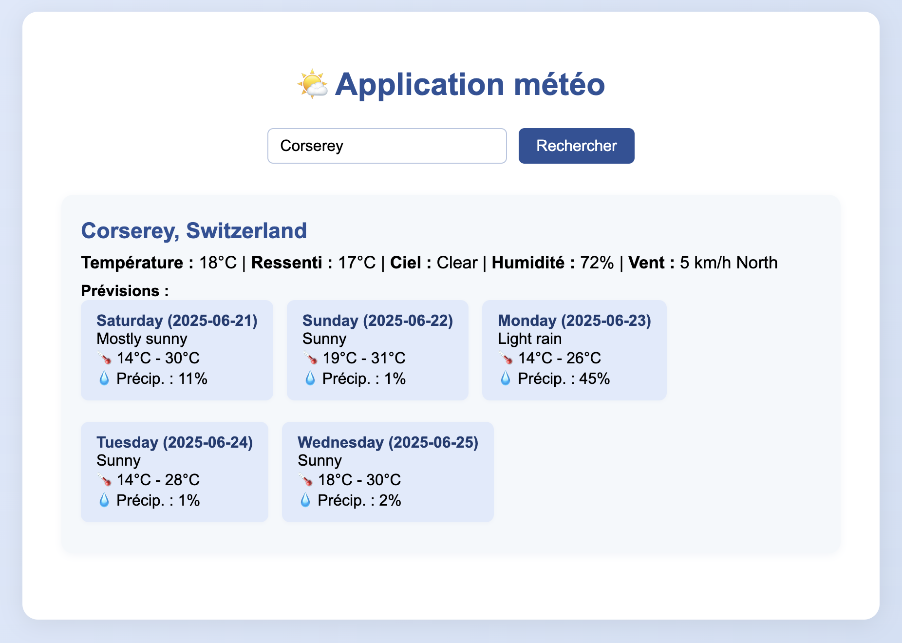

# Évaluation : Composition d'une application Météo

| Libellé | Description |
| --- | --- |
| Durée | 120 minutes |
| Sujet | Composition d'une application Node.js Express Météo |
| Modalité | Travail pratique individuel sur poste informatique avec la machine virtuelle QEMU. Accès à internet sur certains sites. Utilisation interdite de Teams. Accès à l'IA MagicSchool. |

## Objectifs de l'évaluation 
- **Architecture pour la conteneurisation correctement définie**
- **Sélection d'une composition de contenu (architecture) adaptée à la situation. [h1.1, h1.2, h1.4]** 
- **Application virtualisée selon les consignes**
- **Virtualiser est une application avec la composition de conteneurs sélectionnés au sein des fins de développement qui pour la livrée/l'entreprise. [h3.1, h3.2, h3.4, h3.5]**
- **Fonctionnalité de l'application vérifiée à l'aide d'un concept de test**

## Contexte
Vous travaillez comme développeur dans une entreprise qui souhaite avoir une application de météo. Votre équipe a décidé d'utiliser Docker pour déployer ses applications. Comme première expérience, on vous demande de conteneuriser une application Node.js avec Express et une autre application node api météo, disponible ici : [weather-api](https://github.com/tuhinpal/weather-api).

## Structure du projet

```
.
├── weather-api/
├── (voir référence de l'api)
└── weather-frontend/
    ├── server.js
    ├── package.json
    └── views/
        └── index.ejs
```

## Travail à réaliser

Dans un premier temps, vous devrez analyser l'application [weather-api](https://github.com/tuhinpal/weather-api) et documenter ses prérequis techniques, notamment l'utilisation de Node.js, les dépendances nécessaires et les ports requis pour son fonctionnement. Cette analyse préliminaire est essentielle pour la suite du travail.

Dans un deuxième temps, vous devrez analyser l'application [weather-frontend](/weather-frontend/) qui se trouve localement et documenter ses prérequis techniques, notamment l'utilisation de Node.js, les dépendances nécessaires et les ports requis pour son fonctionnement. Cette analyse préliminaire est essentielle pour la suite du travail.

Ensuite, vous créerez un fichier de déploiement qui contiendra toutes les instructions nécessaires pour construire la composition de toute l'application.

Veuillez suivre les paramètres suivants pour déployer votre application :

Application weather-api :
- **Version du Node** : `20`
- **Port de sortie** : `8080`
- **Url d'accès à l'application** : http://weather-api:8080 (grâce au réseau Docker Compose)

Application weather-frontend :
- **Version du Node** : `20`
- **Port de sortie** : `3000`

La phase suivante concernera l'exécution et le test du déploiement. Vous utiliserez les commandes appropriées pour exécuté la composition des conteneurs.

Tout au long du processus, vous devrez documenter minutieusement votre travail, incluant les commandes utilisées, les problèmes rencontrés et leurs solutions, ainsi que les choix techniques que vous aurez effectués.

## Aide durant l'évaluation
Vous avez la possiblité d'utiliser MagicSchool.AI pour vous aider à mettre en place cette infrastructure.

https://student.magicschool.ai/s/join

L'enseignant vous transmettera le code de la session durant l'évaluation.

## Résultat attendu


## Livrables attendus

À la fin de l'évaluation, vous devrez fournir :
- le ou les fichiers de déploiement Docker commenté à mettre dans les répertoire [weather-frontend](/weather-frontend/) et [weather-api](/weather-api/)
- le fichier de déploiement Docker de composition à mettre dans le repertoire racine du projet
- une documentation technique complète du déploiement au format markdown à compléter dans le document [README](/docs/README.md),

La qualité de la documentation et la clarté des explications seront particulièrement évaluées.

## Aide pour la rédaction de markdown
- [CheatSheat Markdown](markdown.md)