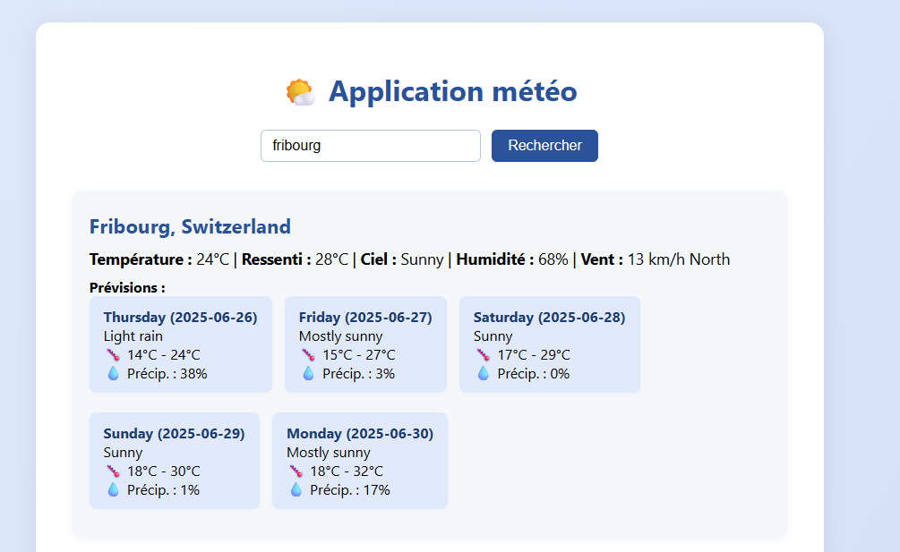

# Documentation technique
Veuillez écrire votre documentation technique dans ce document !

## weather api
Weather api a besoin d'axios, cors et d'express pour fonctionner et fonctionnera sur le port 8080.

## weather frontend
Weather frontend fonctionnera sur le port 3000 et a besoin de axios, ejs et express.

## fichiers
J'ai fait un fichier docker-compose et deux fichier dockerfile qui ressemble à ceci :

docker-compose.yml 
```yml
services :
  weather-api :
    #construit l'image par rapport au dockerfile dans le dossier weather-api
    build : ./weather-api
    #ouvre les ports 8080
    ports : 
      - "8080:8080"
    #lance le script "start" qui est dans le package.json
    command : ["npm", "run", "start"]

  
  weather-frontend :
    #construit l'image par rapport au dockerfile dans le dossier frontend
    build : ./frontend
    #ouvre les ports 3000
    ports :
      - "3000:3000"
    #lance le script "start" qui est dans le package.json
    command : ["npm", "run", "start"]
```

weather-api/dockerfile
```dockerfile
FROM node:20

#clone le projet github dans le container
RUN git clone https://github.com/cachecleanerjeet/weather-api.git

WORKDIR /weather-api

#installe les dépendances
RUN npm install
```

frontend/dockerfile
```dockerfile
FROM node:20

#copie les fichiers frontend dans le container
COPY ./weather-frontend .

WORKDIR ./weather-frontend

#installe les dépendances
RUN npm install
```

J'ai aussi modifier le fichier server.js dans la parti frontend en remplacant les ????????? par l'url correct .
```js
const response = await axios.get(`http://weather-api:8080/location/${encodeURIComponent(location)}`);
```

## commandes utilisées

```text
docker compose up
```
pour démarer tous les services dans le fichier docker-compos.

```text
docker compose build
```
pour construire / reconstruire les images.

## problèmes rencontré
J'avais une erreur qui disait que express n'estais pas trouvé. Au final j'ai remarqué que j'avais mal écrit le "run npm install".

## choix techniques
J'ai décider d'utiliser deux dockerfile en plus du fichier docker-compose car je trouve ça plus simple a comprendre en séparant d'un coté les fichiers copier ou cloner et en installant les dépendances et de l'autre les ports ou autres si nessesaire.

## résulatat obtenu
